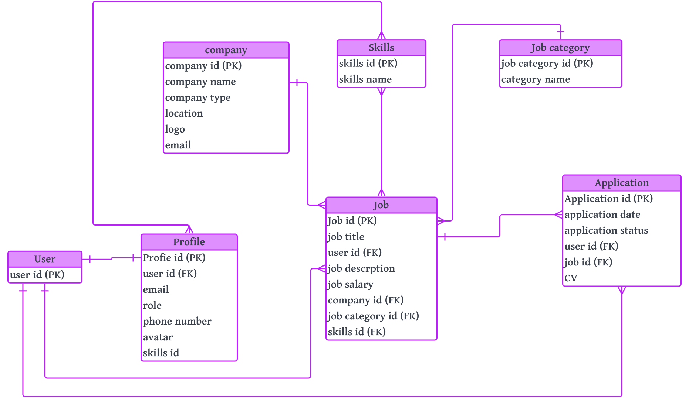

# JobBoard-FE
# Skill Sail

## Overview

A job board is an online platform designed to facilitate the job-seeking and recruitment process, catering to three distinct user roles: job seekers, company administrators, and super administrators.

1. **Job Seeker**
   - *Definition:* An individual actively searching for employment opportunities.
   - *Utilization:* Explore various job listings, apply for positions aligned with skills and preferences.
   - *Profile Management:* Create personalized profiles, upload resumes, and track application statuses.
   - *Objective:* Focus on finding and securing employment opportunities.

2. **Company Administrator**
   - *Definition:* Representative of an employer or hiring entity responsible for posting job openings.
   - *Utilization:* Create detailed job listings, specifying requirements, responsibilities, and qualifications.
   - *Recruitment Management:* Review and respond to job applications, engage with candidates, and schedule interviews.
   - *Communication Features:* Streamline the hiring process through effective communication.

3. **Super Administrator**
   - *Definition:* Overseer of the entire job board platform, ensuring smooth operation and effectiveness.
   - *Access:* Privileged access to all functionalities and data for monitoring activities.
   - *Authority:* Intervene in disputes, enforce policies, and implement system-wide changes.
   - *Responsibility:* Maintain platform integrity, manage user accounts, and address technical issues.

Overall, the job board acts as a dynamic and collaborative space, connecting job seekers with potential employers through a user-friendly interface. The differentiated roles of job seekers, company administrators, and super administrators contribute to the platform's efficiency in serving the needs of both job seekers and employers in the job market.

## Developers & Collaborators Team
#### Maryam Mohammed
#### Sara Nedhal
#### Samia Jamal
#### Marwa AlKhashram
#### Kawthar Mahfoodh

## Technologies Used
- React
- Bootstrap
- Django
- PostgreSQL
- JSON Web Token
- JWT-Decode
- React
- React-Dom
- React-Router-Dom

## Getting Started
### To get started with the Job Board Application, follow these steps:
1.  Clone the repository.
- git clone https://github.com/your-username/job-board.git

2. Navigate to the project directory.
- cd job-board

3. Install dependencies.
- npm install

4. Configure the application settings and database connection. 

5. Run the application.
- npm start

6. Access the application through your preferred web browser.

## ERD SkillSail 

#### This is the ERD for SkillSail Application 

- https://lucid.app/lucidchart/91a480c7-9d45-4930-a2e0-3898de800ecc/edit?invitationId=inv_da3b814f-d5f8-4940-9e4c-70968e37c090&page=0_0#
JobBoard-FE/jobboardfe/public/
C:\Users\Samia\OneDrive\Desktop\Job Bard Project\JobBoard-BE\jobboard\main_app\static\images\wireframes\1.png
## Wireframes

## Trello Board
- https://trello.com/b/WFBDazyP/job-board-capstone-project

## User Stories
#### SuperAdmin Stories 
- As a SuperAdmin, I can change Users to Company Admins
- As a SuperAdmin, I can delete Jobs.
- As a SuperAdmin, I can delete Users.
- As a SuperAdmin, I can delete Company.
- As a SuperAdmin, I can add Company.
- As a SuperAdmin, I can add Users.
#### User Stories
- User must be able to Sign Up
- User must be able to Login
- User must be able to Logout 

#### Job Seeker Stories
- As a Job Seeker, I can View the Job 
- As a Job Seeker, I can View the Company Profile
- As a Job Seeker, I can Apply for a Job Application 
- As a Job Seeker, I can Update my Profile
- As a Job Seeker, I can Upload my CV 
#### Company Admin
- As a Company Admin, I can Post Jobs
- As a Company Admin, I can Accept or Reject The Application
- As a Company Admin, I can Update the Company Information 

## Features
- Responsive Site
- CRUD Operations
- Mobile Responsive
- Single-Page Application
## Screenshots

## Future Features Enhancements
- 
## List of Unsolved Problems and Difficulties

